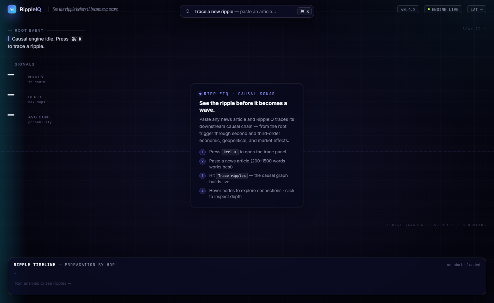
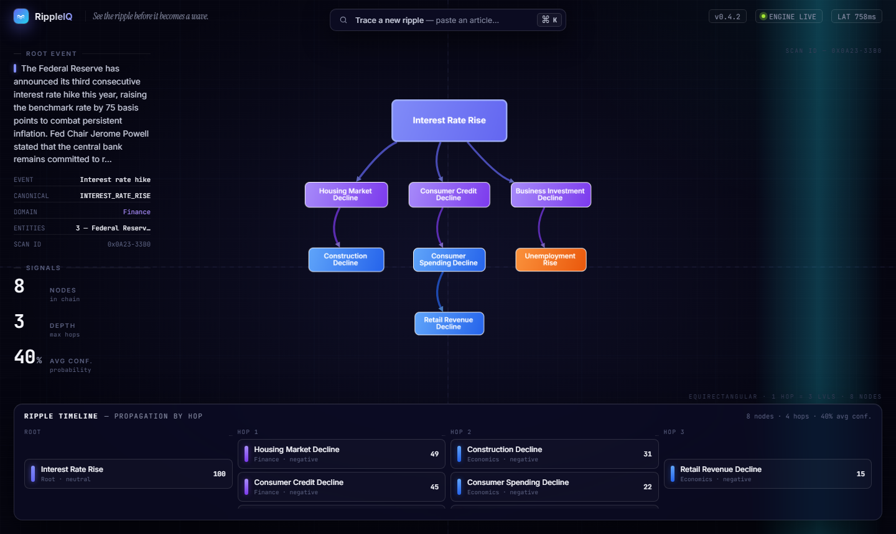

# RippleIQ — Causal Sonar

> **See the ripple before it becomes a wave.**

RippleIQ is a real-time causal reasoning engine that transforms any news article into a living, interactive graph of downstream consequences — tracing how a single triggering event propagates through economic, geopolitical, financial, and societal systems.

---

## Screenshots

### Homepage — Empty State


### Live Causal Graph — After Article Input


---

## What It Does

Paste a news article. RippleIQ extracts the root cause event using a large language model, maps it to a canonical node in a hand-crafted causal knowledge graph, and then runs a probabilistic breadth-first search that surfaces second-, third-, and fourth-order consequences — rendered as a branching, interactive graph with domain-color coding, confidence scoring, and ripple timeline.

**Example:** A Federal Reserve rate hike article → extracts `INTEREST_RATE_RISE` → propagates to `HOUSING_MARKET_DECLINE` → `CONSUMER_CREDIT_DECLINE` → `CONSTRUCTION_DECLINE` → `RETAIL_REVENUE_DECLINE`, each node scored by cumulative causal probability.

---

## Architecture

```
News Article (raw text)
        │
        ▼
┌─────────────────────┐
│   LLM Extractor     │  llama-3.3-70b-versatile via Groq
│   (extractor.py)    │  → raw_event, entities[], domain
└────────┬────────────┘
         │
         ▼
┌─────────────────────┐
│   Event Normalizer  │  llama-3.1-8b-instant + thefuzz fallback
│   (normalizer.py)   │  → canonical graph node name
└────────┬────────────┘
         │
         ▼
┌─────────────────────┐
│   Causal Graph      │  NetworkX DiGraph
│   (graph_engine.py) │  47 nodes · 59 rules · 8 domains
└────────┬────────────┘
         │
         ▼
┌─────────────────────┐
│   BFS Propagator    │  Exponential decay scoring
│   (propagator.py)   │  score = parent × strength × prob × 0.75^hop
└────────┬────────────┘
         │
         ▼
┌─────────────────────┐
│  FastAPI + Cytoscape │  Interactive dag graph
│  (main.py / index)  │  Dagre layout · hover/inspect · timeline
└─────────────────────┘
```

---

## Knowledge Graph

The causal graph (`data/causal_rules.json`) encodes **59 directional causal rules** across 8 domains, hand-authored with direction, probability, propagation strength, and estimated lag time:

| Domain | Example Chain |
|---|---|
| **Finance** | `INTEREST_RATE_RISE` → `HOUSING_MARKET_DECLINE` → `CONSTRUCTION_DECLINE` |
| **Economics** | `INFLATION_RISE` → `CONSUMER_SPENDING_DECLINE` → `RETAIL_REVENUE_DECLINE` |
| **Energy** | `OIL_SUPPLY_DISRUPTION` → `OIL_PRICES_RISE` → `TRANSPORT_COSTS_RISE` |
| **Agriculture** | `LOW_RAINFALL` → `CROP_YIELD_DECLINE` → `FOOD_PRICES_RISE` |
| **Geopolitics** | `TRADE_WAR` → `IMPORT_TARIFFS_RISE` → `MANUFACTURING_COSTS_RISE` |
| **Technology** | `SEMICONDUCTOR_SHORTAGE` → `ELECTRONICS_PRODUCTION_DECLINE` |
| **Health** | `PANDEMIC_OUTBREAK` → `WORKFORCE_REDUCTION` → `SUPPLY_CHAIN_DISRUPTION` |
| **Labor** | `UNEMPLOYMENT_RISE` → `CONSUMER_SPENDING_DECLINE` |

Each rule carries:
- `strength` — how strongly the cause drives the effect (0–1)
- `probability` — likelihood the effect actually occurs (0–1)
- `lag_days` — estimated real-world propagation time
- `direction` — `positive` or `negative` causal influence

---

## Scoring Model

Each node in the propagated chain receives a cumulative score:

```
score(node) = parent_score × edge_strength × edge_probability × 0.75^hop
```

Propagation terminates when `score < 0.05` or `hop > 6`. The best score per node wins if multiple paths reach the same node.

---

## UI Features

| Feature | Description |
|---|---|
| **Command Palette** | `Ctrl K` opens the article input panel |
| **Graph Canvas** | Cytoscape.js + Dagre layout, domain-color-coded nodes |
| **Node Hover** | Dims unrelated nodes, highlights connected subgraph |
| **Inspector Panel** | Click any node for full metadata (impact score, hop, probability, direction) |
| **Ripple Timeline** | Bottom ribbon shows propagation by hop column |
| **Latency Pill** | Real API round-trip time measured client-side |
| **Scan ID** | Every analysis gets a unique trace ID |
| **Empty State** | Frosted-glass onboarding card on first load |

---

## Project Structure

```
causal-engine/
├── main.py                  # FastAPI app, routes
├── requirements.txt         # Python dependencies
├── .env                     # GROQ_API_KEY (not committed)
├── data/
│   └── causal_rules.json    # 59-rule causal knowledge graph
├── pipeline/
│   ├── extractor.py         # LLM root-cause extraction
│   ├── normalizer.py        # LLM + fuzzy node mapping
│   ├── graph_engine.py      # NetworkX graph builder
│   └── propagator.py        # BFS causal propagation
├── models/
│   └── schemas.py           # Pydantic request/response models
├── static/
│   └── index.html           # Full frontend (Cytoscape.js)
├── demo/
│   └── sample_article.txt   # Complex demo article for testing
└── screenshots/
    ├── homepage.png
    └── result.png
```

---

## Quickstart

### 1. Clone

```bash
git clone https://github.com/Saran-Adhith/PROJECT-RippleIQ.git
cd PROJECT-RippleIQ
```

### 2. Install Dependencies

```bash
pip install -r requirements.txt
```

### 3. Configure API Key

Create a `.env` file in the project root:

```
GROQ_API_KEY=your_groq_api_key_here
```

Get a free key at [console.groq.com](https://console.groq.com).

### 4. Run

```bash
uvicorn main:app --reload
```

Open [http://localhost:8000](http://localhost:8000).

### 5. Try It

- Press `Ctrl K` to open the trace panel
- Paste the article from `demo/sample_article.txt` (China semiconductor export controls scenario — triggers technology → economics → finance → labor chains)
- Click **Trace ripples**

---

## API Reference

### `POST /analyze`

Extract and propagate a causal chain from a news article.

**Request**
```json
{
  "article": "Full news article text..."
}
```

**Response**
```json
{
  "root_event": "china imposes semiconductor export controls",
  "canonical_node": "SEMICONDUCTOR_SHORTAGE",
  "domain": "technology",
  "entities": ["China", "TSMC", "Nvidia", "U.S."],
  "causal_chain": [
    {
      "id": "SEMICONDUCTOR_SHORTAGE",
      "label": "Semiconductor Shortage",
      "hop": 0,
      "score": 1.0,
      "domain": "technology",
      "direction": "neutral",
      "probability": 1.0,
      "edge_strength": null,
      "parent": null
    }
  ],
  "edges": [...],
  "stats": {
    "total_nodes": 8,
    "max_depth": 3,
    "avg_confidence": 0.42
  }
}
```

### `GET /graph-schema`

Returns the full causal graph as Cytoscape-ready nodes and edges — useful for visualizing the entire knowledge base.

### `GET /health`

```json
{ "status": "ok", "graph_nodes": 47, "graph_edges": 59 }
```

---

## Tech Stack

| Layer | Technology |
|---|---|
| Backend | Python 3.11 · FastAPI · Uvicorn |
| LLM Inference | Groq API (llama-3.3-70b-versatile · llama-3.1-8b-instant) |
| Graph Engine | NetworkX DiGraph |
| Fuzzy Matching | thefuzz + python-levenshtein |
| Frontend | Vanilla JS · Cytoscape.js v3.26 · cytoscape-dagre v2.5 |
| Fonts | Inter · JetBrains Mono · Instrument Serif (Google Fonts) |
| Data Validation | Pydantic v2 |

---

## Requirements

```
fastapi
uvicorn[standard]
groq
networkx
pydantic
python-dotenv
thefuzz
python-levenshtein
```

---

---

*Built by Saran Adhith*
